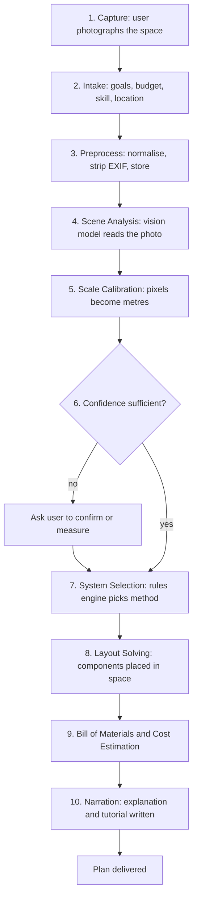

# 3. How It Works

This document describes the full journey in plain language, with no implementation detail. It is the shared mental model everything else in the documentation refines.

## The ten stages

---

### Stage 1 — Capture

The user photographs their space. Guidance in the UI asks for:

- The whole space in frame, taken from a doorway or corner
- Good even lighting, taken during the day where possible
- A **reference object** of known size in shot — a door, a standard bottle, a tape measure, a sheet of A4 paper. This is the single largest driver of dimensional accuracy.
- Optionally, two or three additional angles

Camera capture happens in-browser on mobile; desktop users upload a file.

### Stage 2 — Intake

A short form, four questions, no account required:

1. **What would you like to grow?** (leafy greens / herbs / fruiting vegetables / mixed / not sure)
2. **Roughly what is your budget?** (a slider with sensible bands, in the user's currency)
3. **How much building are you comfortable with?** (assemble only / basic tools / comfortable cutting and drilling)
4. **Where are you?** (country, for currency, pricing, and climate)

Everything else is inferred. The form is deliberately short; each additional question measurably reduces completion.

### Stage 3 — Preprocess

The uploaded image is normalised: orientation corrected, resized to the analysis resolution, converted to a consistent format. EXIF is read for focal length and capture time (useful signals) and then **stripped** — GPS coordinates in particular are removed before storage. The cleaned image goes to object storage; a job is queued.

### Stage 4 — Scene Analysis

A vision-language model examines the photo and returns a strictly structured description of the space. Not prose — a typed object. It reports things like:

- Space type (indoor room / garage / balcony / greenhouse / open ground)
- Apparent dimensions and the reference object it used to judge them
- Surfaces: floor material, wall material, ceiling height and type
- Light: window count, size, compass orientation if inferable, existing fixtures, outdoor shading
- Utilities: visible power outlets, taps, drains, hose bibs
- Obstructions: furniture, vehicles, doors and their swing, walkways that must stay clear
- Environment: signs of damp, frost risk, direct sun exposure
- A **confidence score for each field**

In parallel, a monocular depth model produces a relative depth map, giving the geometry that a language model alone estimates poorly.

### Stage 5 — Scale Calibration

Relative depth plus a known reference dimension yields metric scale. The system tries, in order of reliability:

1. A user-supplied measurement ("that wall is 3.4 m")
2. A detected standard object with a known typical size (interior door about 2.0 m tall, brick course, A4 sheet, standard outlet plate)
3. EXIF focal length combined with the depth map
4. Nothing — in which case it asks the user

### Stage 6 — Confidence gate

If key dimensions are below the confidence threshold, the flow **stops and asks** rather than proceeding on a guess. The user is shown what the system believes and invited to correct it: *"I think this wall is about 3.2 m wide — is that close?"*

This gate is what keeps goal **G4** honest. A plan built on a wrong dimension is worse than no plan.

### Stage 7 — System Selection

A deterministic rules engine scores each of the six hydroponic system types against the analysed space and the user's stated goals. Inputs include usable area, ceiling height, light availability, water access, drainage, power, ambient temperature, budget, and skill level.

Each system carries hard requirements (an NFT channel needs a continuous slope and a pump; Kratky needs neither) and soft preferences. Hard failures eliminate a system; soft scores rank the survivors.

The output is a ranked list with an explicit reason for every score, which is what later becomes the human-readable "why this system" explanation.

### Stage 8 — Layout Solving

The chosen system is instantiated into the space. The solver treats it as a constrained placement problem:

- The space is reduced to a usable-area polygon after removing obstructions, door swings, and required walkways
- Modules (grow channels, reservoir, pump, lighting rig, work area) are placed to maximise growing area subject to constraints
- Constraints include access aisles, reservoir proximity to the pump, gravity fall for return lines, light coverage overlap, and clearance from heat sources

The result is a set of positioned, sized components with coordinates — a real plan, not a picture. Because every component carries a true position, size, and rotation, the same output drives both the 2D plan drawing and the interactive 3D view the user can rotate and inspect (see [3D Visualisation](20-3d-visualization.md)).

### Stage 9 — Bill of Materials and Cost

The layout is expanded into parts. A 4-metre NFT channel run becomes: channel stock, end caps, net pots at a computed spacing, tubing of computed length, a pump sized to the computed head and flow, fittings, a reservoir of computed volume, a timer, and so on.

Each part maps to a catalog entry with regional price bands. Quantities are computed with waste allowances. The total is expressed as a **range** — budget / typical / premium — plus a separate monthly running cost covering electricity, nutrients, growing media, and seeds.

### Stage 10 — Narration

Only now does a language model write prose, and it writes only from the structured output of stages 4–9. It produces:

- A plain-language explanation of the space analysis
- The reasoning for the system choice, drawn from the scoring reasons
- An ordered build tutorial: phases, steps, tools, time estimates, safety callouts
- A grow plan: crops suited to the system and climate, spacing, nutrient schedule, expected first harvest

It is not permitted to introduce a number, a part, or a dimension that did not come from the engine.

---

## Worked example

**Input:** a photo of a garage, taken from the door. Budget $600. Wants "mixed vegetables". Located in Malaysia. Skill: comfortable with tools.

**Stage 4 finds:** concrete floor, 5.8 m by 3.1 m, ceiling 2.6 m, one small high window on the left wall, two double outlets on the back wall, a utility sink in the near-right corner, a car occupying roughly the right half, roller door on the short wall.

**Stage 5 calibrates** against the roller door width (standard 2.4 m), cross-checked against the depth map.

**Stage 6** passes: dimensional confidence high.

**Stage 7 reasons:** natural light is inadequate for fruiting crops, so supplemental lighting is mandatory and the crop mix is narrowed toward leafy greens plus compact fruiting varieties. Usable area is the left half only, about 5.8 m by 1.5 m. Water and drainage are present at the sink. Power is present. Ambient temperature in Malaysia is high, so root-zone temperature control matters and deep water culture in a large-volume reservoir is favoured over shallow NFT film, which heats quickly.

**Ranked result:** (1) DWC with a large-volume reservoir, (2) vertical tower for area efficiency, (3) NFT — eliminated as marginal on thermal grounds, with the reason shown.

**Stage 8 places:** two DWC benches 2.4 m by 0.6 m along the left wall, a 200 L reservoir beneath the near bench next to the sink, an air pump on a wall shelf, an LED bar rig suspended 0.45 m above the canopy, and a 0.8 m aisle preserved for car access.

**Stage 9 computes:** 96 plant sites, a bill of 34 line items, a build range of MYR 1,900 / 2,650 / 3,400, and a running cost of about MYR 95 per month, dominated by lighting electricity.

**Stage 10 writes:** a 6-phase, 41-step tutorial spread over an estimated two weekends, with a structural note that each filled bench weighs approximately 190 kg and must sit on the floor rather than on a shelf.

---

## Where each part of the system does its work

| Stage | Who does it | Why |
|---|---|---|
| 3 Preprocess | Deterministic code | Image handling is solved; no judgement needed |
| 4 Scene analysis | Vision model | Reading an arbitrary scene is exactly what it is good at |
| 5 Calibration | Depth model plus code | Geometry, not language |
| 7 Selection | Rules engine | Must be explainable, testable, and identical for identical inputs |
| 8 Layout | Solver | Packing is an optimisation problem, not a language problem |
| 9 Cost | Catalog plus code | Arithmetic and lookup; models are unreliable at both |
| 10 Narration | Language model | Writing clearly is exactly what it is good at |

This division is elaborated in [AI Pipeline](06-ai-pipeline.md).
