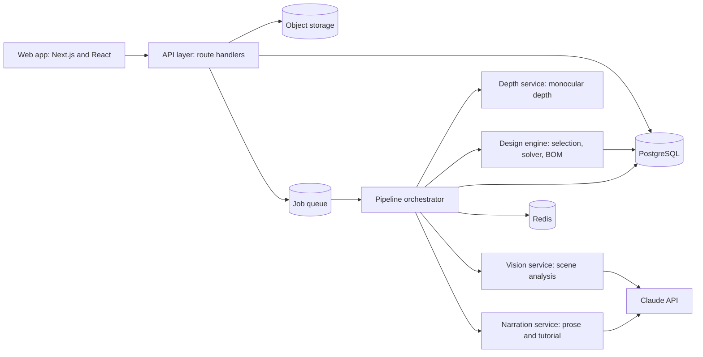

# 5. System Architecture

## Architectural principles

1. **Deterministic core, probabilistic edges.** Model calls sit at the boundary. Everything that produces a number a user acts on is ordinary, testable code.
2. **Schema at every seam.** Every stage input and output is a validated typed object. A stage that receives invalid input fails loudly rather than degrading.
3. **Jobs, not requests.** Plan generation takes 40–90 seconds. It runs as a durable background job with observable state, never inside an HTTP request.
4. **Stage-level idempotence.** Any stage can be re-run in isolation given its stored input. Correcting a dimension re-runs stages 5 onward, not stage 1.
5. **Everything is auditable.** For any delivered plan, every stage's input, output, model version, prompt version, and catalog version is recoverable. Without this, quality regressions are undiagnosable.

---

## Service topology



### Components

| Component | Responsibility | Technology |
|---|---|---|
| **Web app** | Capture, intake, progress, plan rendering, adjustment UI | Next.js (App Router), React, TypeScript, Tailwind |
| **API layer** | Auth, upload signing, job creation, plan reads, streaming progress | Next.js route handlers on serverless functions |
| **Job queue** | Durable work distribution, retries, dead-lettering | Redis-backed queue (BullMQ) or a managed equivalent |
| **Orchestrator** | Runs the ten stages in order, persists each stage result, handles retries, emits progress events | Node worker service (long-running container, not serverless) |
| **Vision service** | Structured scene extraction from images | Claude vision with a strict tool schema |
| **Depth service** | Monocular relative depth map, scale calibration | Python service running an open depth model (Depth Anything V2 or equivalent) |
| **Design engine** | System selection, layout solving, BOM expansion, costing | Pure TypeScript library, no I/O, no network |
| **Narration service** | Explanations, tutorial, grow plan prose | Claude, with structured engine output as its sole context |
| **PostgreSQL** | All relational state: users, spaces, jobs, plans, versions, catalog | Managed Postgres (Supabase or Neon) |
| **Object storage** | Original and processed images, generated PDFs, layout SVGs | S3-compatible bucket with signed URLs |
| **Redis** | Queue backing, progress pub/sub, rate limiting, response caching | Managed Redis |

**Why the design engine is a pure library:** it is the part most likely to be wrong, most in need of tests, and least in need of infrastructure. Keeping it free of I/O means the entire selection-plus-layout-plus-costing path can be exercised in milliseconds in unit tests, with fixture spaces, and property-tested for constraint violations. It is also the part that must be deterministic — same input, same output, forever.

---

## Request lifecycle

### Upload and job creation

```
POST /api/spaces
  -> validate intake payload
  -> create space row (status: draft)
  -> return signed upload URLs

PUT <signed url>            (client uploads directly to object storage)

POST /api/spaces/:id/generate
  -> verify images present, run cheap quality checks
  -> create plan_job row (status: queued)
  -> enqueue job
  -> 202 Accepted { jobId }
```

The client never proxies image bytes through the API. Direct-to-storage uploads keep serverless functions small and fast.

### Progress streaming

```
GET /api/jobs/:id/stream        (Server-Sent Events)
```

The orchestrator publishes stage transitions to a Redis channel; the API subscribes and relays them as SSE. Polling `GET /api/jobs/:id` is the fallback where SSE is unavailable.

### Orchestration

The orchestrator executes stages sequentially, writing each result to `stage_results` before advancing:

```
preprocess -> analyze_scene -> estimate_depth -> calibrate_scale
  -> [confidence gate] -> select_system -> solve_layout
  -> expand_bom -> estimate_cost -> narrate
  -> render_assets (2D SVG + Scene3D projection + isometric still) -> complete
```

`analyze_scene` and `estimate_depth` are independent and run concurrently.

The confidence gate can suspend the job in state `awaiting_input`. A user response resumes it from `calibrate_scale` without re-running the expensive vision stages.

### Retry policy

| Failure class | Policy |
|---|---|
| Transient model or API error (429, 5xx, timeout) | Exponential backoff, 3 attempts |
| Schema validation failure on model output | One repair attempt with the validation error fed back, then fail the stage |
| Engine constraint violation (solver produced an invalid layout) | No retry — this is a bug. Fail loudly, alert, capture the input as a regression fixture. |
| Depth service unavailable | Degrade: proceed with vision-only estimation at lower confidence, which will usually trip the confidence gate |
| Job exceeds wall-clock budget | Cancel, mark failed, no charge |

---

## Data flow contracts

Each stage has a versioned schema. The contract shape:

```ts
type StageResult<T> = {
  stage: StageName
  version: string          // schema version
  input_hash: string       // hash of the stage input, for cache and audit
  output: T
  confidence?: number      // 0-1, where the stage produces estimates
  provenance: {
    model?: string         // e.g. "claude-opus-5"
    prompt_version?: string
    catalog_version?: string
    duration_ms: number
    token_usage?: { input: number; output: number }
  }
}
```

Every downstream stage declares which upstream outputs it consumes. That declaration is what makes selective re-runs safe: changing a dimension invalidates exactly the stages whose declared inputs changed.

---

## Caching

| What | Key | Why |
|---|---|---|
| Scene analysis | hash(image bytes + prompt version + model) | Re-generating a plan for the same photo should not re-pay for vision |
| Depth map | hash(image bytes + model version) | Same |
| Engine output | hash(scene + intake + engine version + catalog version) | Adjustments frequently produce identical engine inputs |
| Narration | hash(engine output + prompt version) | Regenerating a PDF should not re-pay for prose |
| Catalog prices | region + catalog version | Read-heavy, changes rarely |

Cache hits are the primary lever on unit cost. See [Deployment and Operations](17-deployment-operations.md#cost-control).

---

## Failure isolation

- The web app renders a saved plan with zero dependency on the pipeline. An outage of the vision provider does not take down plan viewing.
- The design engine has no network dependency, so it cannot fail from an outage.
- If the narration stage fails, the plan is still delivered with the layout, BOM, and cost — the parts users act on — with prose marked as pending and regenerated in the background.

The dependency ordering is deliberate: the further down the pipeline a stage sits, the less essential it is to a usable result.

---

## Environments

| Environment | Purpose | Model access | Data |
|---|---|---|---|
| `local` | Development | Recorded fixtures by default; live models behind a flag | Seeded, synthetic |
| `preview` | Per-pull-request deploys | Live models, low rate limit | Ephemeral branch database |
| `staging` | Pre-release verification, evaluation runs | Live models, production config | Anonymised copy |
| `production` | Live | Live models | Live |

Fixture-first local development matters: the pipeline is expensive and slow to run live. A recorded set of representative spaces (about 50) lets an engineer iterate on the engine without a single API call.

---

## Scaling considerations

- **Orchestrator workers scale horizontally.** Jobs are independent; there is no cross-job coordination.
- **Vision throughput is the bottleneck and the cost centre.** Concurrency is capped per provider, and requests queue rather than drop.
- **The depth service is GPU-hungry.** It runs as a separately scaled pool and can scale to zero at low traffic, accepting a cold-start penalty.
- **Postgres is not on the hot path during generation** beyond stage-result writes; read replicas serve plan viewing if needed.
- **Rate limiting** is per-IP for anonymous generation and per-account thereafter, protecting the largest cost item from abuse.

---

## Repository layout

The intended monorepo shape once code exists:

```
hydroponer/
  apps/
    web/                  Next.js app: pages, components, API routes
    worker/               Orchestrator and stage runners
    depth/                Python depth service
  packages/
    engine/               Pure design engine (selection, solver, BOM, costing)
    catalog/              Materials, crops, system definitions (data and loaders)
    schemas/              Zod schemas shared across every boundary
    prompts/              Versioned prompt templates and fixtures
    ui/                   Shared React components
    scene/                Layout to Scene3D projection, shared by the viewer and its tests
    models/               glTF part library, keyed to catalog item ids
  docs/                   This documentation
  evals/                  Evaluation suites and golden fixtures
```
