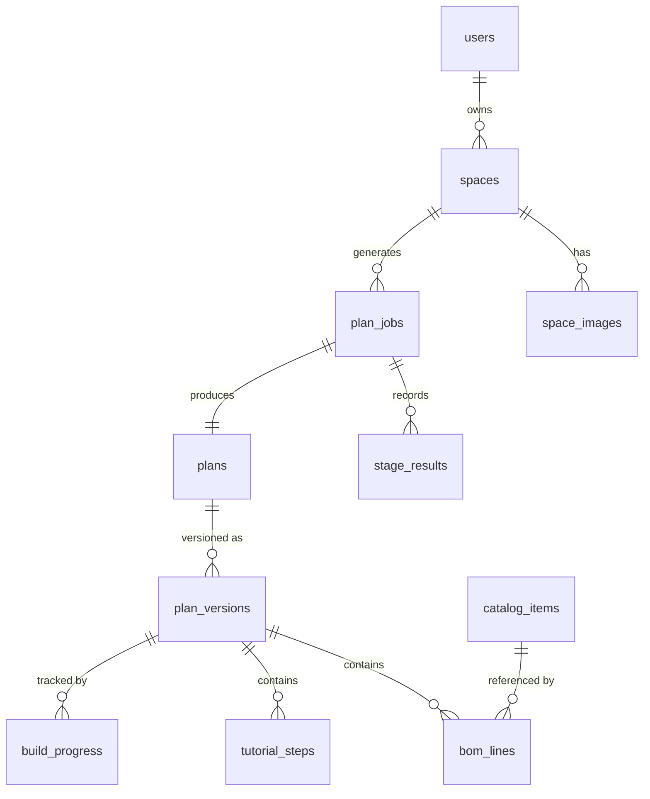

# 11. Data Model

PostgreSQL. All timestamps are `timestamptz` in UTC; all dates are ISO 8601. All physical quantities are stored in SI base units with the unit in the column name — `width_mm`, `mass_kg`, `flow_lpm` — so that a unit error is visible at the point of use rather than three functions later.

---

## 11.1 Entity overview



---

## 11.2 Core tables

### `users`

```sql
create table users (
  id              uuid primary key default gen_random_uuid(),
  email           citext unique not null,
  display_name    text,
  country_code    char(2) not null,           -- ISO 3166-1 alpha-2, e.g. 'MY'
  currency_code   char(3) not null,           -- ISO 4217, e.g. 'MYR'
  unit_system     text not null default 'metric'  check (unit_system in ('metric','imperial')),
  skill_level     text check (skill_level in ('assemble','basic_tools','confident')),
  created_at      timestamptz not null default now(),
  deleted_at      timestamptz
);
```

Authentication credentials are not stored here; they live with the auth provider. `deleted_at` supports soft deletion with a scheduled hard purge (see [Security and Privacy](15-security-privacy.md)).

### `spaces`

A physical place a user wants to plan for.

```sql
create table spaces (
  id              uuid primary key default gen_random_uuid(),
  user_id         uuid references users(id) on delete cascade,   -- null while anonymous
  anon_session_id text,                                          -- claimed on signup
  name            text not null default 'My space',
  intake          jsonb not null,     -- goals, budget, skill, country at time of intake
  status          text not null default 'draft'
                  check (status in ('draft','analyzing','awaiting_input','planned','failed')),
  created_at      timestamptz not null default now(),
  updated_at      timestamptz not null default now()
);
create index on spaces (user_id);
create index on spaces (anon_session_id) where user_id is null;
```

Example `intake`:

```json
{
  "grow_goal": "mixed",
  "budget": { "amount": 600, "currency": "USD" },
  "skill": "basic_tools",
  "country_code": "MY",
  "climate_zone": "tropical_wet"
}
```

### `space_images`

```sql
create table space_images (
  id              uuid primary key default gen_random_uuid(),
  space_id        uuid not null references spaces(id) on delete cascade,
  role            text not null check (role in ('primary','supporting')),
  storage_key     text not null,          -- object storage path, never a public URL
  content_hash    text not null,          -- sha256 of the normalised bytes; the cache key
  width_px        int not null,
  height_px       int not null,
  exif_stripped   boolean not null default true,
  quality_score   numeric(3,2),           -- blur/exposure check, 0-1
  created_at      timestamptz not null default now(),
  expires_at      timestamptz             -- retention clock; see privacy policy
);
```

`content_hash` is what makes vision caching possible: the same photo uploaded twice never pays for analysis twice.

### `plan_jobs`

```sql
create table plan_jobs (
  id              uuid primary key default gen_random_uuid(),
  space_id        uuid not null references spaces(id) on delete cascade,
  status          text not null default 'queued'
                  check (status in ('queued','running','awaiting_input','succeeded','failed','cancelled')),
  current_stage   text,
  error_code      text,
  error_detail    jsonb,
  attempt         int not null default 1,
  queued_at       timestamptz not null default now(),
  started_at      timestamptz,
  finished_at     timestamptz,
  duration_ms     int,
  cost_usd        numeric(10,5),          -- accumulated model spend for this job
  engine_version  text,
  catalog_version text
);
create index on plan_jobs (space_id, queued_at desc);
create index on plan_jobs (status) where status in ('queued','running','awaiting_input');
```

### `stage_results`

The audit trail. One row per stage execution, never updated in place.

```sql
create table stage_results (
  id              uuid primary key default gen_random_uuid(),
  job_id          uuid not null references plan_jobs(id) on delete cascade,
  stage           text not null,          -- 'analyze_scene', 'solve_layout', ...
  schema_version  text not null,
  input_hash      text not null,
  output          jsonb not null,
  confidence      numeric(4,3),
  provenance      jsonb not null,         -- model, prompt_version, tokens, duration
  cache_hit       boolean not null default false,
  created_at      timestamptz not null default now()
);
create index on stage_results (job_id, created_at);
create index on stage_results (stage, input_hash);   -- serves the cache lookup
```

This table is the single most valuable thing in the database for debugging. Every delivered plan can be traced back to the exact model output, prompt version, and engine version that produced it.

### `plans` and `plan_versions`

```sql
create table plans (
  id              uuid primary key default gen_random_uuid(),
  space_id        uuid not null references spaces(id) on delete cascade,
  current_version int not null default 1,
  share_slug      text unique,            -- null until shared
  share_includes_photo boolean not null default false,
  created_at      timestamptz not null default now()
);

create table plan_versions (
  id              uuid primary key default gen_random_uuid(),
  plan_id         uuid not null references plans(id) on delete cascade,
  version         int not null,
  parent_version  int,                    -- what this was adjusted from
  change_summary  text,                   -- "Switched from NFT to DWC"
  scene           jsonb not null,         -- the analysed space
  system_choice   jsonb not null,         -- ranked systems with reasons
  layout          jsonb not null,         -- placed components, runs, warnings
  cost            jsonb not null,         -- three-point build + running cost
  grow_plan       jsonb not null,
  narration       jsonb,                  -- null while narration is pending
  layout_svg_key  text,
  pdf_key         text,
  created_at      timestamptz not null default now(),
  unique (plan_id, version)
);
```

Storing the full engine output as `jsonb` rather than fully normalising it is deliberate: a plan version is an immutable snapshot, it is always read whole, and normalising it would couple the database schema to the engine's evolving shape. The parts that need querying — BOM lines and tutorial steps — are extracted into their own tables.

### `bom_lines`

```sql
create table bom_lines (
  id              uuid primary key default gen_random_uuid(),
  plan_version_id uuid not null references plan_versions(id) on delete cascade,
  phase           int not null,
  catalog_item_id text not null references catalog_items(id),
  label           text not null,
  quantity        numeric(10,3) not null,
  unit            text not null,
  purchase_qty    numeric(10,3) not null,  -- rounded to purchasable units
  tier            text not null check (tier in ('budget','typical','premium')),
  unit_price_low  numeric(10,2) not null,  -- in the plan's currency
  unit_price_high numeric(10,2) not null,
  rationale       text,                    -- "sized for 12 L/min at 1.4 m head"
  substitutes     jsonb,
  sort_order      int not null
);
create index on bom_lines (plan_version_id, phase, sort_order);
```

### `tutorial_steps`

```sql
create table tutorial_steps (
  id              uuid primary key default gen_random_uuid(),
  plan_version_id uuid not null references plan_versions(id) on delete cascade,
  phase           int not null,
  step_index      int not null,
  title           text not null,
  instruction     text not null,
  tip             text,
  parts           jsonb not null,          -- bom_line ids consumed here
  tools           jsonb not null,
  measurements    jsonb not null,
  safety_blocks   jsonb not null,          -- rendered template text, verbatim
  verification    text not null,
  estimated_minutes int not null,
  unique (plan_version_id, phase, step_index)
);
```

### `build_progress`

```sql
create table build_progress (
  id              uuid primary key default gen_random_uuid(),
  plan_version_id uuid not null references plan_versions(id) on delete cascade,
  user_id         uuid references users(id) on delete cascade,
  step_id         uuid not null references tutorial_steps(id) on delete cascade,
  completed_at    timestamptz not null default now(),
  unique (plan_version_id, user_id, step_id)
);
```

---

## 11.3 Catalog tables

The catalog is versioned reference data, seeded from files in `packages/catalog` and loaded by migration so that it is reviewable in pull requests.

```sql
create table catalog_versions (
  version         text primary key,        -- '2026.04.1'
  released_at     timestamptz not null,
  notes           text
);

create table catalog_items (
  id              text primary key,        -- 'pump_submersible_1000lph'
  version         text not null references catalog_versions(version),
  name            text not null,
  category        text not null,
  spec            jsonb not null,
  unit            text not null,
  pack_size       numeric(10,3),
  food_grade      boolean not null default false,
  tiers           jsonb not null,          -- budget/typical/premium price bands, USD
  substitutes     text[] not null default '{}',
  diy_alternative jsonb,
  lifespan_years  numeric(4,1),
  sources         text[] not null default '{}',
  reviewed_by     text,
  reviewed_at     date
);

create table regional_pricing (
  country_code    char(2) primary key,
  multiplier      numeric(5,3) not null,   -- versus the USD baseline
  electricity_kwh_usd numeric(6,4) not null,
  water_m3_usd    numeric(6,4),
  surveyed_at     date not null
);

create table fx_rates (
  currency_code   char(3) primary key,
  usd_rate        numeric(14,6) not null,
  fetched_at      timestamptz not null
);

create table crops (
  id              text primary key,
  version         text not null references catalog_versions(version),
  common_name     text not null,
  class           text not null,
  spacing_mm      int not null,
  mature_height_mm int not null,
  dli_min         numeric(5,2) not null,
  dli_optimal     numeric(5,2) not null,
  ph_low          numeric(3,1) not null,
  ph_high         numeric(3,1) not null,
  ec_low          numeric(4,2) not null,
  ec_high         numeric(4,2) not null,
  temp_low_c      numeric(4,1) not null,
  temp_high_c     numeric(4,1) not null,
  days_to_transplant int not null,
  days_to_harvest int not null,
  yield_per_plant_g int not null,
  compatible_systems text[] not null,
  difficulty      int not null check (difficulty between 1 and 3),
  sources         text[] not null default '{}'
);
```

---

## 11.4 Operational tables

```sql
create table model_calls (
  id              uuid primary key default gen_random_uuid(),
  job_id          uuid references plan_jobs(id) on delete set null,
  stage           text not null,
  model           text not null,
  prompt_version  text not null,
  input_tokens    int not null,
  output_tokens   int not null,
  cost_usd        numeric(10,6) not null,
  latency_ms      int not null,
  cache_hit       boolean not null default false,
  created_at      timestamptz not null default now()
);
create index on model_calls (created_at);
create index on model_calls (stage, created_at);

create table feedback (
  id              uuid primary key default gen_random_uuid(),
  plan_version_id uuid references plan_versions(id) on delete set null,
  user_id         uuid references users(id) on delete set null,
  kind            text not null check (kind in ('accuracy','cost','fit','tutorial','other')),
  rating          int check (rating between 1 and 5),
  comment         text,
  actual_cost     numeric(12,2),           -- what the build really cost
  actual_currency char(3),
  created_at      timestamptz not null default now()
);
```

`model_calls` is what makes unit economics observable per stage. `feedback.actual_cost` is what closes the loop on cost accuracy — it is the measurement behind goal **G3**.

---

## 11.5 Data lifecycle

| Data | Retention | Notes |
|---|---|---|
| Original images | 90 days by default, or until the user deletes them | Configurable down to "delete after analysis" |
| Normalised analysis images | Same clock as the original | |
| Scene analysis output | Retained with the plan | Contains no image, only a structured description |
| Plans and versions | Until the user deletes them | The product's value; the user's data |
| Anonymous spaces | 30 days if never claimed | |
| Stage results | 180 days | Debugging value decays; storage cost does not |
| Model call records | 24 months, aggregated after 90 days | Cost analysis |
| Deleted accounts | Hard purge within 30 days of `deleted_at` | Includes objects in storage |

---

## 11.6 Conventions

- Primary keys are UUIDs, generated by the database
- Every table has `created_at`; mutable tables have `updated_at` maintained by trigger
- Money is `numeric`, never floating point, and always paired with a currency code
- Enumerated values use `text` with a `check` constraint rather than Postgres enums — adding a value should not require a type migration
- `jsonb` payloads are validated by the shared Zod schemas at the application boundary before they are written
- Row-level security is enabled on every user-owned table; the anonymous path is served through a scoped session claim
